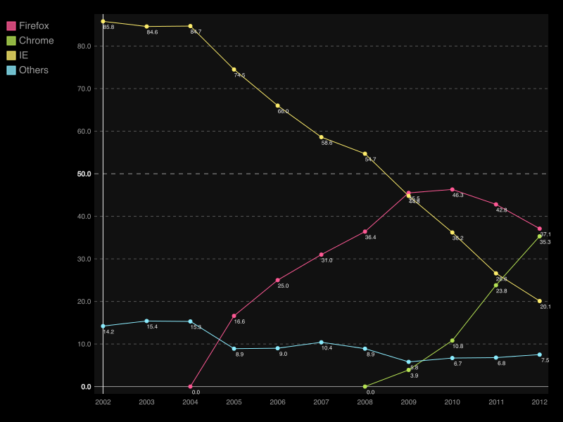
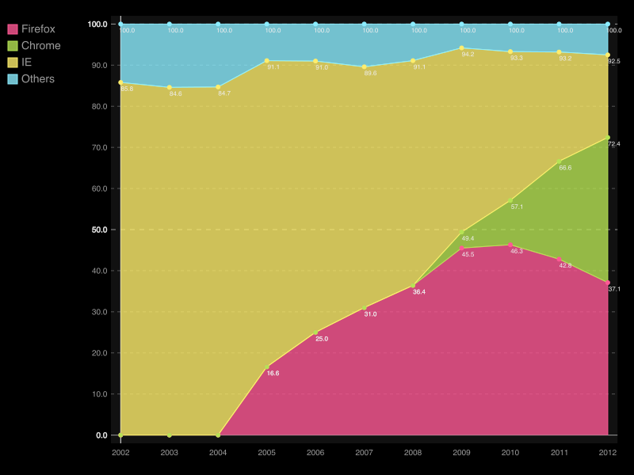
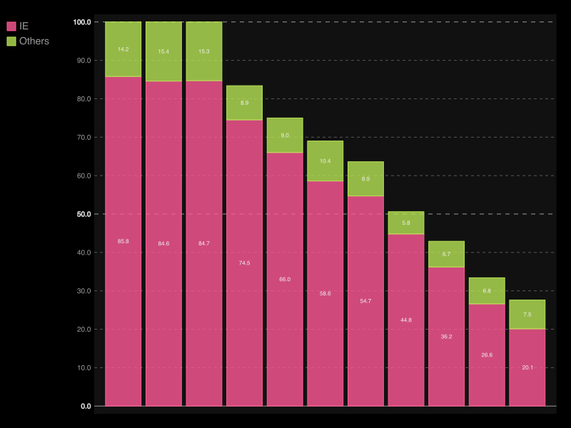

=======
csvplot
=======

Description
===========

Plots columns from a csv file::

    usage: csvplot.py [-h] [-d DELIMITER] [-t] [-q QUOTECHAR] [-u {0,1,2,3}] [-b]
                      [-p ESCAPECHAR] [-z MAXFIELDSIZE] [-e ENCODING] [-S] [-H]
                      [-v] [-l] [--zero] [-x XCOL] [-c YCOL] [--title TITLE]
                      [--type {Line,StackedLine,Bar,StackedBar,XY}]
                      [--output OUTPUT]
                      [FILE]

    Plots columns from a csv file.

    positional arguments:
      FILE                  The CSV file to operate on. If omitted, will accept
                            input on STDIN.

    optional arguments:
      -h, --help            show this help message and exit
      -x XCOL, --x XCOL     Column name or index to be used as x axis
      -c YCOL, --columns YCOL
                            Column names or indexes to be used as y axis (0
                            based). You can use a range 1-3 or comma separated
                            column values 1,3,5. Non-numeric columns are automatically
                            skipped (default: all)
      --title TITLE         The title of the chart
      --type {Line,StackedLine,Bar,StackedBar,XY}
                            Kind of chart to generate
      --output OUTPUT, -o OUTPUT
                            What kind output. default(browser)

See also: :doc:`../common_arguments`.

Dependencies
------------

csvplot uses `pygal <http://pygal.org/>`_ to generate the plots. You can get it with::

    pip install pygal

The render in browser functionality also requires lxml::

    pip install lxml

The PNG output functionality requires `CairoSVG <http://cairosvg.org/>`_, `tinycss <http://packages.python.org/tinycss/>`_ and `cssselect <http://packages.python.org/cssselect/>`_. Those can be installed with::

    pip install CairoSVG tinycss cssselect

Examples
========

Plot browser usage using the "Year" column as the x axis. The result will show up in the default browser::

    $ csvplot examples/realdata/browser_usage.csv -x Year

Make a StackedLine plot and save the result in a .png file::

    $ csvplot examples/realdata/browser_usage.csv -x Year --type StackedLine --output StackedLine.png

Create a StackedBar plot using only the last two columns::

    $ csvplot.py examples/realdata/browser_usage.csv -c 3-4 --type StackedBar

or alternatively::

    $ csvplot.py examples/realdata/browser_usage.csv -c IE,Others --type StackedBar

