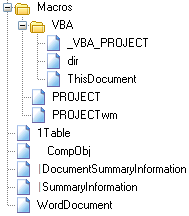

About the structure of OLE files
================================

This page is part of the documentation for [olefile](https://bitbucket.org/decalage/olefileio_pl/wiki). It provides a brief overview of the structure of [Microsoft OLE2 files (also called Structured Storage, Compound File Binary Format or Compound Document File Format)](http://en.wikipedia.org/wiki/Compound_File_Binary_Format), such as Microsoft Office 97-2003 documents, Image Composer and FlashPix files, Outlook messages, StickyNotes, several Microscopy file formats, McAfee antivirus quarantine files, etc.
  
An OLE file can be seen as a mini file system or a Zip archive: It contains **streams** of data that look like files embedded within the OLE file. Each stream has a name. For example, the main stream of a MS Word document containing its text is named "WordDocument".

An OLE file can also contain **storages**. A storage is a folder that contains streams or other storages. For example, a MS Word document with VBA macros has a storage called "Macros".

Special streams can contain **properties**. A property is a specific value that can be used to store information such as the metadata of a document (title, author, creation date, etc). Property stream names usually start with the character '\x05'.

For example, a typical MS Word document may look like this:

Go to the [[API]] page to see how to use all olefile features to parse OLE files.

--------------------------------------------------------------------------

olefile documentation
---------------------

- [[Home]]
- [[License]]
- [[Install]]
- [[Contribute]], Suggest Improvements or Report Issues
- [[OLE_Overview]]
- [[API]] and Usage
